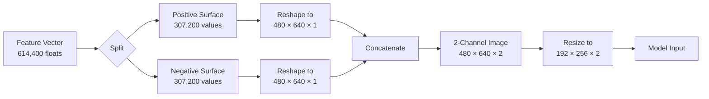

# Gait Classification: Comparing CNN and SNN

This is the repository for the **Gait Classification** project group in Neuromorphic Intelligence, winter semester 2025/2026, at TH Nürnberg.

> The goal of the project is to implement gait classification based on an event-based camera system, comparing both a Neuromorphic SNN approach and a classical CNN approach.
> The project also contains an implementation of live classification linked to the event-based camera.

The data for this analysis and the live prediction were obtained using the DAVIS 346 DVS event camera from Inivation.

## Data Collection and Preprocessing

For data collection, the DV software from Inivation was used with the configuration file `davis/gait.xml`. The datasets are stored in AEDAT4 files, containing noise-filtered events and the camera stream for later validation of the data.

To obtain a comparable dataset, the collection setup positioned the camera at a height of 80 cm and at a distance of 300 cm from a person crossing the field of view diagonally over 250 cm. One person at a time walked from left to right, turned around outside the field of view, and then walked back in the opposite direction, again turning around outside the field of view. This results in the graph below, which shows the events recorded when a person passes through the field of view back and forth.

The collected data are larger than 20 GB of data, and for both models are pre-processing the same way described below using the `feature_extraction.py` and `preprocess_data.py` script with following preprocessing settings:

| Setting | Value | Description |
| ------- | ------- | ------- |
| Feature Method | Time Surface | Converts events to features using exponential decay based on event recency |
| Activity Window MS | 1000 | Time window in milliseconds for checking event activity |
| Activity Minimum Events | 75000 | Minimum number of events in a window; below this threshold labels as 'stale' |
| Event Window MS | 1000 | Duration of each event window in milliseconds |
| Validation Split Size | 0.2 | Proportion of data (20%) reserved for validation |
| Test Split Size | 0.1 | Proportion of data (10%) reserved for testing |
| Random Seed | 42 | Seed for reproducible random shuffling and splitting |
| Keep Labels | 'mark', 'marvin', 'yannes' | Person identities to retain; others mapped to 'unknown' |
| Stale Label | 'stale' | Label assigned to windows with insufficient event activity |
| Other Label | 'unknown' | Label assigned to persons not in the keep_labels list |

### Feature Extraction

The `feature_extraction.py` script converts AEDAT4 files from the DAVIS camera into numpy arrays containing raw event data (coordinates, timestamps, and polarities). It scans `data/raw/` for `.aedat4` files, extracts all events using the `dv_processing` library, and saves them as `.npy` files in `data/binary/` for subsequent preprocessing.

### Preprocessing Steps

The `preprocess_data.py` script performs the following preprocessing steps:

1. **Loading and Feature Extraction**: Reads event data from `.npy` files in `data/binary/` and extracts features using the specified method, generating a feature vector for each event window.

2. **Label Remapping**: Maps the person identities to a final class set. Keeps the specified labels, maps all others to 'unknown', and preserves the 'stale' label for low-activity windows.

3. **Class Balancing**: Windows with event activity below the threshold (`activity_min_events`) are labeled as 'stale'. The 'stale' class is then balanced by randomly downsampling it to match the average count of non-stale classes, ensuring the dataset is not dominated by low-activity samples.

4. **Feature Normalization**: Applies z-score normalization to each feature dimension across the entire dataset to ensure consistent scaling.

5. **Index Shuffling**: Creates a random permutation of samples using the specified random seed for reproducibility.

6. **Train/Validation/Test Splitting**: Divides the shuffled dataset into three splits using stratified sampling to maintain class distribution.

7. **Data Saving**: Saves the preprocessed data and split indices to `data/processed/` in a memory-efficient format suitable for model training.

8. **Cleanup**: Removes temporary memory-mapped files used during processing.

The figure below illustrates a sample event window after preprocessing, showing the time surface visualization that represents event activity patterns over the 1-second temporal window.
Each pixel measures recent events, and their positive or negative values create movement patterns.

## Traditional Neural Networks

The traditional neural network approach converts the preprocessed time surface features into 2-channel images and applies various deep learning architectures for classification. This section presents a systematic evaluation of multiple architectures, identifies the optimal model configuration, and analyses the factors contributing to performance differences.

### Feature Preprocessing for CNN

The preprocessed feature vectors are converted to 2-channel images representing positive and negative event polarities. Each channel captures the temporal decay pattern of events with the respective polarity, preserving both spatial and temporal structure of the event data.

| Stage | Shape | Features |
| ----- | ----- | -------- |
| Original Vector | 614,400 × 1 | Flattened time surface |
| Split Channels | 307,200 × 2 | Positive and negative surfaces |
| Reshaped | 480 × 640 × 2 | Full resolution image |
| Downsampled | 192 × 256 × 2 | Model input size |

The two channels encode brightness increases (positive polarity) and brightness decreases (negative polarity) respectively. This representation enables the use of standard image-based deep learning architectures while maintaining the event-driven nature of the data.

### Architecture Comparison

To identify the optimal architecture for gait classification on event-based data, a evaluation of eight model types was conducted. The selection encompasses pure convolutional networks, Vision Transformers with various enhancements, and recurrent architectures to assess which inductive biases best suit the task.

| Model | Type | Key Innovation | Rationale |
| ----- | ---- | -------------- | --------- |
| Simple CNN Large | Pure CNN | 4-block convolutional architecture | Baseline model with strong local feature extraction capabilities |
| Basic Transformer ViT | Vision Transformer | Patch embedding with self-attention | Captures global spatial relationships across the entire image |
| Improved Transformer | ViT + Stochastic Depth | Random layer dropping during training | Reduces overfitting on small datasets through regularization |
| CLS-Token Transformer | ViT + Classification Token | Learnable token for aggregating features | Standard ViT approach with dedicated classification representation |
| Relative Position Transformer | ViT + 2D Relative Encoding | Learns relative spatial relationships | Position-agnostic pattern recognition for gait features |
| Hybrid CNN-Transformer | CNN Stem + Transformer | Deep CNN followed by attention layers | Combines local CNN features with global transformer context |
| LSTM | Recurrent | Image rows as temporal sequence | Models sequential patterns in gait motion |
| CNN-LSTM | Hybrid Sequential | CNN features fed to bidirectional LSTM | Combines spatial feature extraction with temporal modeling |

The figures below present the comparative evaluation results. The first figure displays validation and test accuracy across all architectures, while the second figure analyses inference time, model confidence, and parameter counts.

The evaluation reveals that the Simple CNN Large architecture significantly outperforms all other approaches, achieving 95.07% test accuracy compared to the next-best Hybrid CNN-Transformer at 90.46%. The complete quantitative comparison is summarised in the table below.

| Model | Test Accuracy | Inference Time | Parameters |
| ----- | ------------- | -------------- | ---------- |
| Simple CNN Large | 95.07% | 31.1 ms | 1.24M |
| Hybrid CNN-Transformer | 90.46% | 36.3 ms | 2.23M |
| Relative Position Transformer | 89.80% | 38.2 ms | 2.46M |
| CLS-Token Transformer | 89.47% | 38.5 ms | 2.44M |
| Improved Transformer | 88.16% | 38.0 ms | 2.44M |
| CNN-LSTM | 87.83% | 37.0 ms | 5.57M |
| Basic Transformer ViT | 83.88% | 38.5 ms | 2.44M |
| LSTM | 69.74% | 54.5 ms | 0.86M |

The superior performance of the straightforward CNN over Vision Transformers and recurrent models can be attributed to several factors specific to this classification task. Gait patterns in time surface representations manifest as localised spatial features, which convolutional networks extract efficiently through hierarchical convolutions. In contrast, Transformers are designed to model long-range global dependencies that prove less relevant for this application. Furthermore, the time surface preprocessing already encodes temporal dynamics into the spatial structure of each frame, eliminating the need for models to learn temporal relationships across sequences. Vision Transformers also require substantially more training data to learn effective attention patterns; with approximately 3,000 samples, the dataset favours models with stronger inductive biases over data-hungry architectures. The reduced parameter count of the CNN (1.24M versus 2.4M+ for Transformers) additionally promotes better generalisation by avoiding memorisation of training examples.

The pure LSTM model performs worst (69.74%) because treating image rows as temporal sequences fails to capture the spatial coherence of gait patterns. The CNN-LSTM hybrid improves upon this by first extracting spatial features, yet the additional recurrent processing provides no benefit over the already temporally-encoded time surfaces.

### Possible Improvements

While the current CNN-based approach achieves strong results, several architectural alternatives could potentially improve performance or efficiency:

| Approach | Description | Potential Benefit |
| -------- | ----------- | ----------------- |
| Event-Stream LSTM/RNN | Feed raw event sequences (x, y, t, p) directly to recurrent networks instead of converting to images | Preserves exact temporal resolution; avoids information loss from time surface binning |
| Spatio-Temporal Graphs | Model events as nodes in a graph with spatial and temporal edges | Captures event relationships without fixed grid discretisation |
| Event-based Attention | Apply attention mechanisms directly on event sequences rather than image patches | Learns which events are most relevant for classification |
| Larger Dataset | Collect more subjects and walking conditions | Would enable effective use of higher-capacity models like Transformers |
| Data Augmentation | Apply event-specific augmentations (temporal jitter, spatial noise, polarity flipping) | Increases effective dataset size without additional collection |

### Simple CNN Large Architecture

The Simple CNN Large model achieved the best performance across all evaluated architectures and serves as the primary CNN implementation. The architecture employs a classic convolutional design with four progressive feature extraction blocks, optimised for the 2-channel event image input.

| | Layer | Configuration | Output |
| ----- | ----- | ------------- | ------ |
| &rarr; | Input | 2-channel event image | 480 × 640 × 2 |
| &darr; | Resizing | Bilinear interpolation | 192 × 256 × 2 |
| &darr; | Conv Block 1 | 2 × Conv2D(32, 3×3), BatchNorm, ReLU, MaxPool(2×2), Dropout(0.25) | 96 × 128 × 32 |
| &darr; | Conv Block 2 | 2 × Conv2D(64, 3×3), BatchNorm, ReLU, MaxPool(2×2), Dropout(0.25) | 48 × 64 × 64 |
| &darr; | Conv Block 3 | 2 × Conv2D(128, 3×3), BatchNorm, ReLU, MaxPool(2×2), Dropout(0.25) | 24 × 32 × 128 |
| &darr; | Conv Block 4 | 2 × Conv2D(256, 3×3), BatchNorm, ReLU, MaxPool(2×2), Dropout(0.25) | 12 × 16 × 256 |
| &darr; | Global Avg Pool | Spatial averaging | 256 |
| &darr; | Dense | Fully connected, ReLU, Dropout(0.5) | 256 |
| &larr; | Output | Softmax classification | 5 classes |

**Total Parameters:** 1,239,045

The architecture progressively increases filter depth (32 → 64 → 128 → 256) while reducing spatial dimensions through max pooling, which creates a hierarchical feature representation from low-level edge detectors to high-level gait pattern recognisers. Global average pooling replaces traditional flattening to reduce parameter count and improve spatial invariance.

**Hyperparameters:**

| Parameter | Value | Description |
| --------- | ----- | ----------- |
| Learning Rate | 1e-3 | Initial Adam optimiser learning rate |
| Batch Size | 32 | Samples per gradient update |
| Dropout (Conv) | 0.25 | Regularisation after each convolutional block |
| Dropout (Dense) | 0.5 | Regularisation before output layer |
| Kernel Size | 3 × 3 | Convolutional filter dimensions |
| Pool Size | 2 × 2 | Max pooling window |

**Training Strategy:**

To prevent overfitting on the relatively small dataset, the training employs several regularisation techniques:

- **Learning Rate Scheduling**: ReduceLROnPlateau callback monitors validation loss and reduces the learning rate by 50% after 5 epochs without improvement (minimum LR: 1e-6)
- **Early Stopping**: Training terminates if validation loss shows no improvement for 15 epochs, with automatic restoration of the best weights
- **Dropout Regularisation**: Applied after each convolutional block (0.25) and before the output layer (0.5) to prevent co-adaptation of features
- **Batch Normalisation**: Stabilises training by normalising layer inputs, enabling higher learning rates and faster convergence

The figure below illustrates the training dynamics over 66 epochs, displaying loss and accuracy curves for both training and validation sets. The close tracking between training and validation metrics indicates effective regularisation without significant overfitting.

## Spiking Neural Network (SNN)

The SNN approach uses biologically-inspired Leaky Integrate-and-Fire (LIF) neurons implemented with Nengo and NengoDL. Unlike traditional neural networks, spiking neurons communicate through discrete spike events, making them well-suited for event-based camera data.

### Feature Preprocessing for SNN

The SNN uses spatially downsampled features via 5 x 5 area averaging:

| Stage | Shape | Features |
| ----- | ----- | -------- |
| Original | 640 x 480 x 2 | 614,400 |
| Downsampled | 128 x 96 x 2 | 24,576 |

This 25x reduction in dimensionality enables efficient training while preserving the spatial structure of the event data.

### Model Architecture

| | Layer | Configuration | Parameters |
| ----- | ----- | ------------- | ---------- |
| &rarr; | Input | 24,576 features | Downsampled time surface (128 × 96 × 2) |
| &darr; | Hidden | 107 LIF neurons | Heterogeneous: Gains ~ U(0.5, 1.5), Biases ~ U(-0.5, 0.5) |
| &darr; | Connections | Glorot initialization | Input &rarr; Hidden: 24,576 x 107, Hidden &rarr; Output: 107 x 5 |
| &larr; | Output | 5 classes | Linear readout (raw logits) |

### Hyperparameters

| Parameter | Value | Description |
| --------- | ----- | ----------- |
| Hidden Neurons | 107 | LIF spiking neurons |
| Initial Learning Rate | 6.50e-03 | Starting learning rate |
| Batch Size | 128 | Samples per gradient update |
| Weight Decay | 1.00e-04 | L2 regularization (AdamW) |
| Label Smoothing | 0.15 | Prevents overconfident predictions |
| Gradient Clipping | 1.0 | Max gradient norm |

### Training Strategy

To combat overfitting, the training uses several regularization techniques:

- **Dynamic Learning Rate**: ReduceLROnPlateau callback monitors validation loss and reduces LR by 50% after 10 epochs without improvement (minimum LR: 1e-6)
- **Early Stopping**: Training stops if validation loss doesn't improve for 20 epochs, restoring the best weights
- **Label Smoothing**: Softens one-hot labels to prevent the model from becoming overconfident
- **Gradient Clipping**: Stabilizes training by limiting gradient magnitudes, especially important for spiking networks with noisy surrogate gradients

Training uses NengoDL's TensorFlow backend with surrogate gradients for backpropagation through the non-differentiable spike function.

The figure below shows the training progress over 150 epochs, displaying loss and accuracy curves for both training and validation sets.

## Result Comparison and Live Prediction

tbd;

Whats missing the the certainty threshold

| SNN | CNN |
| --- | --- |
|  | tbd; |

## Live Prediction

tbd;
