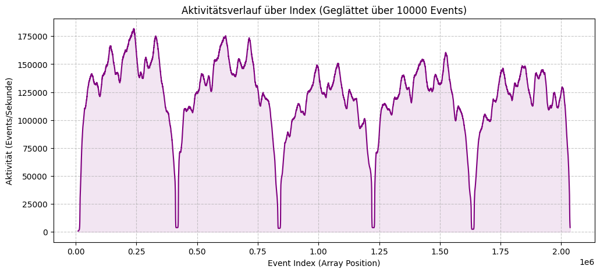
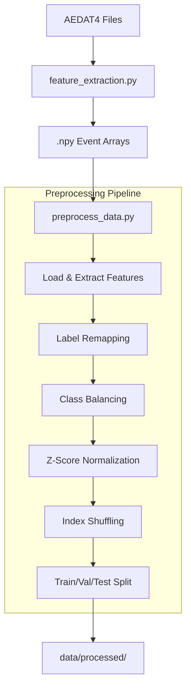
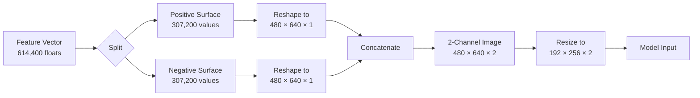
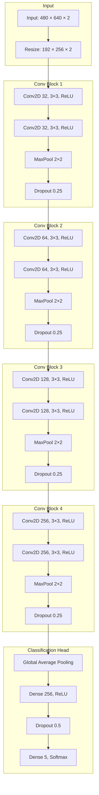

# Gait Classification: Comparing CNN and SNN

This is the repository for the **Gait Classification** project group in Neuromorphic Intelligence, winter semester 2025/2026, at TH Nürnberg.

> The goal of the project is to implement gait classification based on an event-based camera system, comparing both a Neuromorphic SNN approach and a classical CNN approach.
> The project also contains an implementation of live classification linked to the event-based camera.

The data for this analysis and the live prediction were obtained using the DAVIS 346 DVS event camera from Inivation.

## Data Collection and Preprocessing

For data collection, the DV software from Inivation was used with the configuration file `davis/gait.xml`. The datasets are stored in AEDAT4 files, containing noise-filtered events and the camera stream for later validation of the data.

To obtain a comparable dataset, the collection setup positioned the camera at a height of 80 cm and at a distance of 300 cm from a person crossing the field of view diagonally over 250 cm. One person at a time walked from left to right, turned around outside the field of view, and then walked back in the opposite direction, again turning around outside the field of view. This results in the graph below, which shows the events recorded when a person passes through the field of view back and forth.

The collected data are larger than 20 GB of data, and for both models are pre-processing the same way described below using the `feature_extraction.py` and `preprocess_data.py` script with following preprocessing settings:

| Setting | Value | Description |
| ------- | ------- | ------- |
| Feature Method | Time Surface | Converts events to features using exponential decay based on event recency |
| Activity Window MS | 1000 | Time window in milliseconds for checking event activity |
| Activity Minimum Events | 75000 | Minimum number of events in a window; below this threshold labels as 'stale' |
| Event Window MS | 1000 | Duration of each event window in milliseconds |
| Validation Split Size | 0.2 | Proportion of data (20%) reserved for validation |
| Test Split Size | 0.1 | Proportion of data (10%) reserved for testing |
| Random Seed | 42 | Seed for reproducible random shuffling and splitting |
| Keep Labels | 'mark', 'marvin', 'yannes' | Person identities to retain; others mapped to 'unknown' |
| Stale Label | 'stale' | Label assigned to windows with insufficient event activity |
| Other Label | 'unknown' | Label assigned to persons not in the keep_labels list |

### Feature Extraction

The `feature_extraction.py` script converts AEDAT4 files from the DAVIS camera into numpy arrays containing raw event data (coordinates, timestamps, and polarities). It scans `data/raw/` for `.aedat4` files, extracts all events using the `dv_processing` library, and saves them as `.npy` files in `data/binary/` for subsequent preprocessing.

### Preprocessing Steps

The `preprocess_data.py` script performs the following preprocessing steps:

1. **Loading and Feature Extraction**: Reads event data from `.npy` files in `data/binary/` and extracts features using the specified method, generating a feature vector for each event window.

2. **Label Remapping**: Maps the person identities to a final class set. Keeps the specified labels, maps all others to 'unknown', and preserves the 'stale' label for low-activity windows.

3. **Class Balancing**: Windows with event activity below the threshold (`activity_min_events`) are labeled as 'stale'. The 'stale' class is then balanced by randomly downsampling it to match the average count of non-stale classes, ensuring the dataset is not dominated by low-activity samples.

4. **Feature Normalization**: Applies z-score normalization to each feature dimension across the entire dataset to ensure consistent scaling.

5. **Index Shuffling**: Creates a random permutation of samples using the specified random seed for reproducibility.

6. **Train/Validation/Test Splitting**: Divides the shuffled dataset into three splits using stratified sampling to maintain class distribution.

7. **Data Saving**: Saves the preprocessed data and split indices to `data/processed/` in a memory-efficient format suitable for model training.

8. **Cleanup**: Removes temporary memory-mapped files used during processing.

## Convolutional Neural Network (CNN)

The CNN approach converts the preprocessed time surface features back into 2-channel images and applies various deep learning architectures for classification.

### Image Reconstruction from Features

The preprocessed feature vectors (614,400 floats per sample) are converted back to 2-channel images representing positive and negative event polarities. Each channel captures the temporal decay pattern of events with the respective polarity.

The two channels encode:
- **Channel 1 (Positive)**: Time surface of positive polarity events (brightness increases)
- **Channel 2 (Negative)**: Time surface of negative polarity events (brightness decreases)

This representation preserves the temporal and spatial structure of the event data while enabling the use of standard image-based deep learning architectures.

### Model Architectures Evaluated

We evaluated multiple model types to identify the best architecture for gait classification on event-based data:

| Model | Type | Key Innovation | Rationale |
| ----- | ---- | -------------- | --------- |
| Simple CNN Large | Pure CNN | 4-block convolutional architecture | Baseline model with strong local feature extraction capabilities |
| Basic Transformer VIT | Vision Transformer | Patch embedding with self-attention | Captures global spatial relationships across the entire image |
| Improved Transformer | ViT + Stochastic Depth | Random layer dropping during training | Reduces overfitting on small datasets through regularization |
| CLS-Token Transformer | ViT + Classification Token | Learnable token for aggregating features | Standard ViT approach with dedicated classification representation |
| Relative Position Transformer | ViT + 2D Relative Encoding | Learns relative spatial relationships | Position-agnostic pattern recognition for gait features |
| Hybrid CNN-Transformer | CNN Stem + Transformer | Deep CNN followed by attention layers | Combines local CNN features with global transformer context |
| LSTM | Recurrent | Image rows as temporal sequence | Models sequential patterns in gait motion |
| CNN-LSTM | Hybrid Sequential | CNN features fed to bidirectional LSTM | Combines spatial feature extraction with temporal modeling |

### Simple CNN Large Architecture

The Simple CNN Large model achieved the best performance and serves as the primary CNN architecture. It uses a classic convolutional design optimized for the 2-channel event image input.

**Architecture Details:**

| Component | Configuration | Output Shape |
| --------- | ------------- | ------------ |
| Input | 2-channel event image | 480 × 640 × 2 |
| Resizing | Bilinear interpolation | 192 × 256 × 2 |
| Conv Block 1 | 2 × Conv2D(32), MaxPool, Dropout(0.25) | 96 × 128 × 32 |
| Conv Block 2 | 2 × Conv2D(64), MaxPool, Dropout(0.25) | 48 × 64 × 64 |
| Conv Block 3 | 2 × Conv2D(128), MaxPool, Dropout(0.25) | 24 × 32 × 128 |
| Conv Block 4 | 2 × Conv2D(256), MaxPool, Dropout(0.25) | 12 × 16 × 256 |
| Global Avg Pool | Spatial averaging | 256 |
| Dense | Fully connected with ReLU | 256 |
| Output | Softmax classification | 5 classes |

**Total Parameters:** 1,239,045

The architecture progressively increases filter depth (32 → 64 → 128 → 256) while reducing spatial dimensions through max pooling. Dropout regularization at 0.25 after each convolutional block and 0.5 before the output layer helps prevent overfitting on the relatively small dataset. Global average pooling replaces traditional flattening to reduce parameter count and improve generalization.

## Spiking Neural Network (SNN)

tbd;

## Result Comparison and Live Prediction

tbd;
